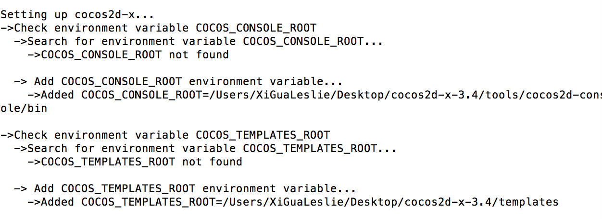
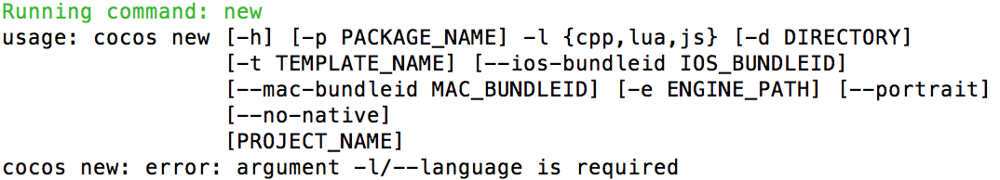
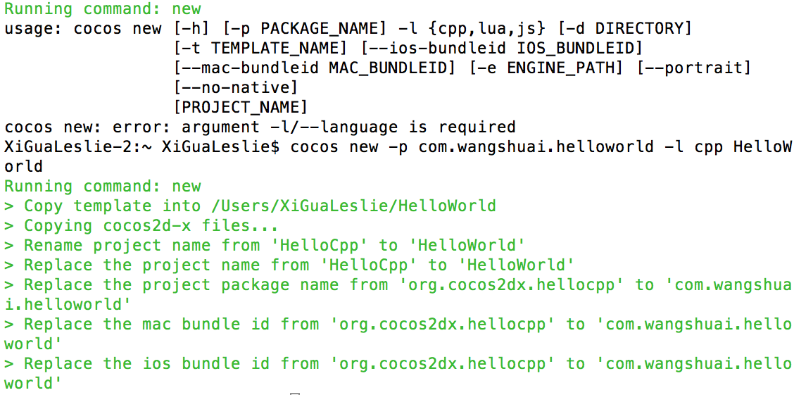
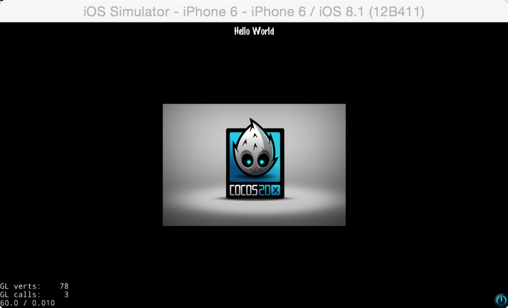
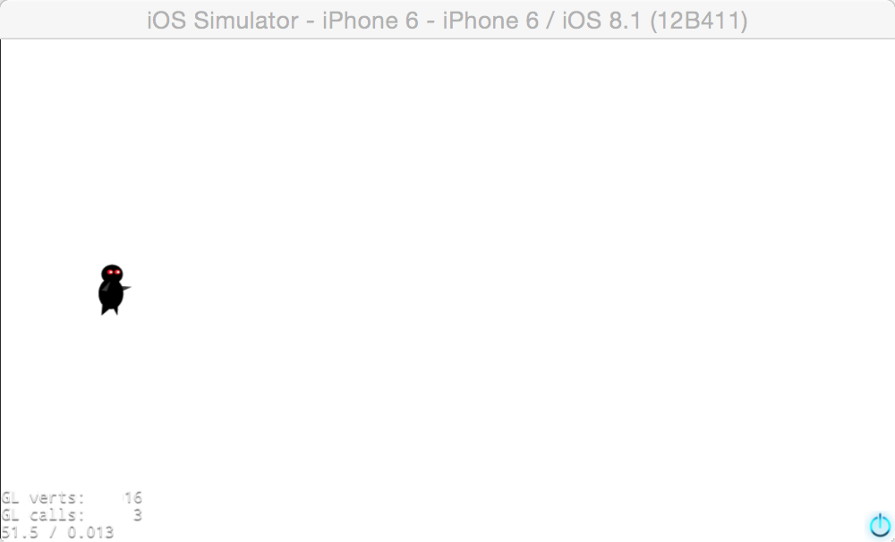
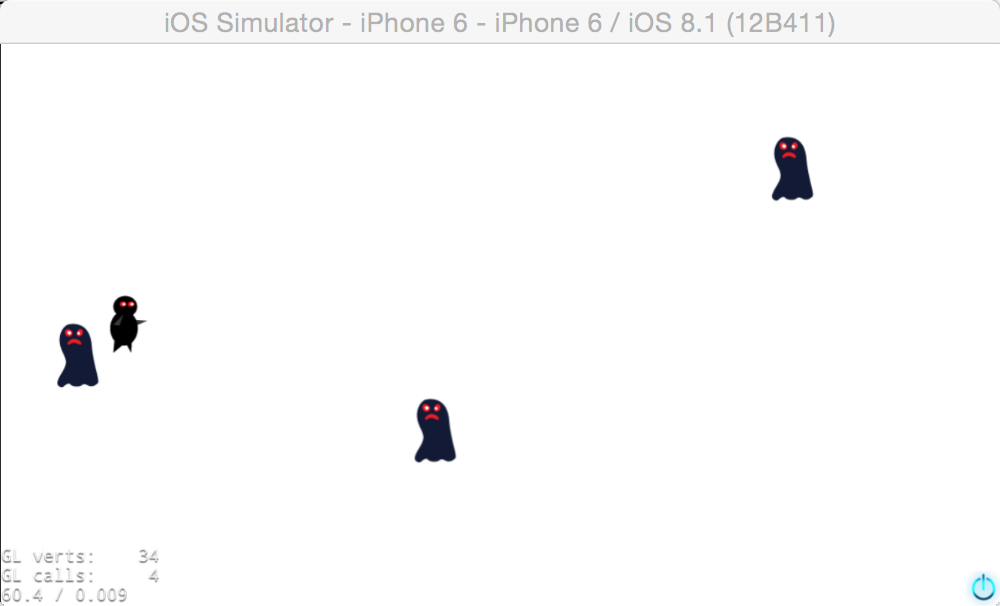
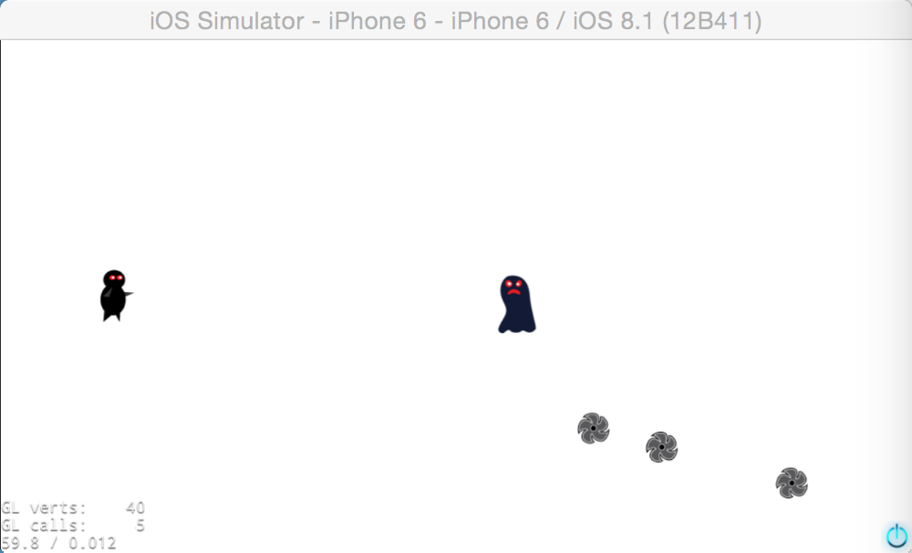
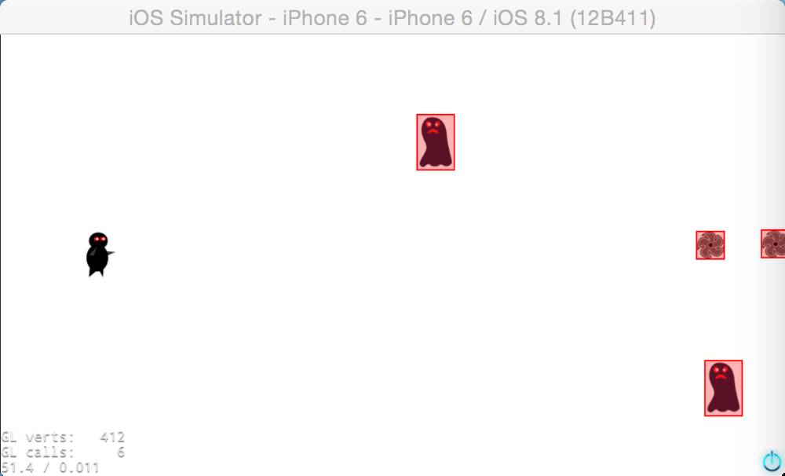

#如何使用Cocos2d-x 3.4制作一个简单的游戏

在这个cocos2d-x 3.4初学者教程中，你能从头到尾的学到怎么样为你的smart phone去制作一个简单而有趣的2d游戏。


##安装 Cocos2d-x

cocos2d-x 3.x配备的新的安装程序，所以入门从未如此简单！！！

只需要[下载最新的cocos2d-x安装程序](http://cn.cocos2d-x.org/download/)（3.4版本或者其他版本），在终端输入`python setup.py`将**cocos**添加到环境变量



脚本运行后你需要重启下你的终端或者设备以使配置生效。

##Hello World

首先让我们先创建一个简单的Hello World项目。

打开终端切换到你打算放置项目的目录，然后输入 `cocos new`,你将获得如下提示：



根据提示信息输入`cocos new -p com.wangshaui.helloworld -l cpp HelloWorld`,获得如下信息则表示创建成功




运行已创建完成的项目，将得到以下效果



点击左下角的按钮将退出游戏。在本教程中，你将和cocos2d-x 一起见证奇迹。

##忍者登场！

在忍者登场之前，你将需要做一些美术工作...

第一步，下载这个项目的[资源包](http://cdn3.raywenderlich.com/downloads/Cocos2DSimpleGameResourcePack.zip)。解压这个文件，并且将资源文件放在**Resource**文件夹中

第二步，打开`HelloWorldScene.cpp`。记住，这里的代码是用来显示上图所示场景的，并且这将成为一个建立游戏的好地方。在你修改它之前，先好好看看这部分实例代码：
```
	bool HelloWorld::init()
	{
    //////////////////////////////
    // 1. super init first
    if ( !Layer::init() )
    {
        return false;
    }
    
    Size visibleSize = Director::getInstance()->getVisibleSize();
    Vec2 origin = Director::getInstance()->getVisibleOrigin();

    /////////////////////////////
    // 2. add a menu item with "X" image, which is clicked to quit the program
    //    you may modify it.

    // add a "close" icon to exit the progress. it's an autorelease object
    auto closeItem = MenuItemImage::create(
                                           "CloseNormal.png",
                                           "CloseSelected.png",
                                           CC_CALLBACK_1(HelloWorld::menuCloseCallback, this));
    
	closeItem->setPosition(Vec2(origin.x + visibleSize.width - closeItem->getContentSize().width/2 ,
                                origin.y + closeItem->getContentSize().height/2));

    // create menu, it's an autorelease object
    auto menu = Menu::create(closeItem, NULL);
    menu->setPosition(Vec2::ZERO);
    this->addChild(menu, 1);

    /////////////////////////////
    // 3. add your codes below...

    // add a label shows "Hello World"
    // create and initialize a label
    
    auto label = Label::createWithTTF("Hello World", "fonts/Marker Felt.ttf", 24);
    
    // position the label on the center of the screen
    label->setPosition(Vec2(origin.x + visibleSize.width/2,
                            origin.y + visibleSize.height - label->getContentSize().height));

    // add the label as a child to this layer
    this->addChild(label, 1);

    // add "HelloWorld" splash screen"
    auto sprite = Sprite::create("HelloWorld.png");

    // position the sprite on the center of the screen
    sprite->setPosition(Vec2(visibleSize.width/2 + origin.x, visibleSize.height/2 + origin.y));

    // add the sprite as a child to this layer
    this->addChild(sprite, 0);
    
    return true;
}
```

如果要添加一个忍者到场景中，你认为该怎么做。

你认为你该怎么做？这里有一些提示：

* 在你不久前添加进项目中的`ResourcePack`中找到忍者的图片。
* 你仅仅只需要修改一行代码！！

###解决方法
在`HelloWorldScene.h`中加入一个私有变量，代码如下：

	Sprite* _player;

在`HelloWorldScene.cpp`中加入如下代码：
```
    _player = Sprite::create("player-hd.png");
    _player->setPosition(visibleSize.width/8,visibleSize.height/2);
    this->addChild(_player);
```	

让我们看看这个忍者在不打怪兽的时候会做些什么，构建并运行项目。




然而，忍者用他一生去训练就是为了战斗！所以接下来你将要添加一些怪兽去挑战忍者！

##一个凶猛的怪兽出现了

接下来你想在你的场景中加入一些怪兽。对于一个有经验的忍者来说，一个静止的怪兽是没有挑战的，所以要做一点有趣的事情，那就是让这些怪兽动起来。你将要创造一个怪兽让它略微向右偏离屏幕，并且为他们建立一个`Aciton`，告诉他们要从右边移动到左边。

将下面的代码加入到`HelloWorldScene.cpp`中：

```
	void HelloWorld::addMonster(float dt)
	{
	//1
    Size visibleSize = Director::getInstance()->getVisibleSize();
    
    Sprite* MonsterExample = Sprite::create("monster-hd.png");
    MonsterExample->setPosition(
                                visibleSize.width + MonsterExample->getContentSize().width,
                                MonsterExample->getContentSize().height/2+CCRANDOM_0_1()*(visibleSize.height - MonsterExample->getContentSize().height/2));
    //2
    Monster.push_back(MonsterExample);
    this->addChild(Monster.back());
    //3
    MoveTo* Move = MoveTo::create(3, Vec2(-Monster.back()->getContentSize().width/2,Monster.back()->getPosition().y));
    Monster.back()->runAction(Move);
	}
```

接下来让我一步一步的讲解：

1. 获取屏幕的分辨率。
2. `Monster`是一个`std::vector<sprite*>`类型的变量用于存储怪兽。 
3. 你将会用到Cocos2D动作`MoveTo:`，让怪兽从起始点（略微偏离屏幕向右）移动到终点（略微偏离屏幕向左），使其迅速的从屏幕右边移动到左边。

你已经见到过了动作中的转动动作，然后Cocos2D提供了大量非常好用的内置动作，比如移动动作、旋转动作、渐隐动作、动画动作等等。

* `MoveTo:` 这个动作是用来控制怪兽移动的，在这里是用来使怪兽从屏幕右边移动到左边。这段路程的持续时间是需要设置的，它表示怪兽穿越屏幕所需要的时间，持续时间越短，忍者的速度就会越快.

好，现在你有方法添加一个怪兽到你的场景中。然而一个怪兽对于一个有经验的忍者是很难构成威胁的，所以让我们创建一个怪物刷新器。

Cocos2D拥有一个调度程序，允许你每X.X秒回调一次，这样你就能创建一个怪物刷新器，让它每X秒加入一个新的怪兽到场景中。

打开`HelloWorldScene.cpp`并且加入如下代码在`init`方法中。
```
    this->schedule(schedule_selector(HelloWorld::addMonster),1);
```	
这样就会添加一个回调计时器让以前添加的`addMonster`方法每1秒添加一个怪兽

注意，当你创建`addMonster`方法时，这里会有一个名为`dt`的参数，这个代表增量时间，就相当于找出之前时间与当前的不同的地方，调度器要求每一个方法都拥有这样一个参数。然而你不会在这个教程中用到这个。


构建并运行，现在你能看见众多的怪兽飞过屏幕！



##Hadouken

 不幸的是你的忍者还没有足够的等级去发射火球，所以你需要依靠你专业的投射基恩能够去消灭这些怪兽。
 
 握住你的手里剑并且让我们添加一些投掷动作。
 
 你又将用到`MoveTo:`，这并不像之前的移动那样简单，但也仅仅需要从`_player->getPosition`移动到点击点就完成了。如果你想沿着你点击的方向投掷手里剑穿越整个屏幕，你只需要用上一点点数学知识。
 
你必须从原点到点击点构造一个三角形并且再用同样的比例构造一个更大的三角形 — 而且你知道你想要的终点是在屏幕之外。

去做一些计算，它是真的有帮助，如果你知道一些基本的数学矢量知识的话（例如一些轻松加减向量的方法），Cocos2D包含有一个好用的矢量处理功能，就比如`ccpAdd`和`cppSub`。

如果你不确定以下的任何计算，就请看看这个[数学矢量解释](http://www.mathsisfun.com/algebra/vectors.html)，我个人推荐关于这一主题优秀的[Khan Academy](https://www.khanacademy.org/math/linear-algebra/vectors_and_spaces/vectors/v/vector-introduction-linear-algebra)视频教程。

###学会触摸

在`HelloWorldScene.h`中添加如下代码：
```
    virtual bool onTouchBegan(Touch* pTouch, Event* pEvent);
    virtual void onTouchMoved(Touch* pTouch, Event* pEvent);
    virtual void onTouchEnded(Touch* pTouch, Event* pEvent);
```

并且添加一个私有变量：
```
	    EventListenerTouchOneByOne* touch_listener;
```
这个变量用来监听单点触摸事件。
	
在`HelloWorldScene.cpp`中的`init`中添加如下代码：
```	
	    touch_listener = EventListenerTouchOneByOne::create();
    touch_listener->setSwallowTouches(false);
    touch_listener->onTouchBegan = CC_CALLBACK_2(HelloWorld::onTouchBegan, this);
    touch_listener->onTouchMoved = CC_CALLBACK_2(HelloWorld::onTouchMoved, this);
    touch_listener->onTouchEnded = CC_CALLBACK_2(HelloWorld::onTouchEnded, this);
    touch_listener->onTouchCancelled = CC_CALLBACK_2(HelloWorld::onTouchCancelled, this);
    _eventDispatcher->addEventListenerWithSceneGraphPriority(touch_listener, this);
```    
这里注册单点触摸时间，并且为事件设置属性和添加回调函数。
    
然后在`HelloWorldScene.cpp`中加入如下代码：

```
	bool HelloWorld::onTouchBegan(Touch* pTouch, Event* pEvent)
	{
    Size visibleSize = Director::getInstance()->getVisibleSize();
    Point touchLocation = pTouch->getLocationInView();
    touchLocation = Director::getInstance()->convertToGL(touchLocation);
    Sprite* projectileExmaple = Sprite::create("projectile-hd.png");
    projectileExmaple->setPosition(visibleSize.width/8,visibleSize.height/2);
    projectile.push_back(projectileExmaple);
    this->addChild(projectile.back());
    Point offset = ccpSub(touchLocation, _player->getPosition());
    float ratio = offset.y/offset.x;
    int targetX  = _player->getContentSize().width/2 + visibleSize.width;
    int targetY = (targetX*ratio) + _player->getPosition().y;
    Vec2 targetPosition = Vec2(targetX,targetY);
    MoveTo* Move = MoveTo::create(2, targetPosition);
    projectile.back()->runAction(Move);
    return true;
	}
	void HelloWorld::onTouchMoved(Touch* pTouch, Event* pEvent)
	{
	}
	void HelloWorld::onTouchEnded(Touch* pTouch, Event* pEvent)
	{
	}
```


构建并运行，然后开战吧！！



啊啊啊啊！！！这群怪兽太强大了！！为什么他们现在不会死亡！！

##物理引擎和碰撞检测


所以你现在拥有一个忍者，还有满屏飞舞的怪兽和手里剑。现在看起来不错，但是如果加入一点碰撞会更加有趣。为了做到这点，你需要为手里剑和怪兽添加碰撞检测。

Cocos2d-x 3.4中的一个很好的特点就是它深度集成了物理引擎，这让这个任务变的容易的许多。物理引擎很好的模拟了实际运动，然而用它来实现碰撞检测十分方便。

现在你要做的就是使用Cocos2d-x物理引擎去检查怪兽和手里剑何时碰撞了，你需要四个步骤完成它：

* `建立物理世界` 将当前的场景建立为物理世界，在这个场景中物理引擎回去模拟现实生活中的物理行为，例如重力或者碰撞等等。
* `创建钢体` 为每一个场景中的精灵绑定相同大小的钢体。
* `碰撞检测` 实现碰撞时将要执行的函数功能。

让我们开始吧。

回到`HelloWorldScene.cpp`，在`init`方法中找到如下代码：
```
	auto scene = Scene::createWithPhysics();
```	
用如下代码代替它：
```
	//1
    auto scene = Scene::createWithPhysics();
    //2
    scene->getPhysicsWorld()->setGravity(Vect(0,0));
    //3
        scene->getPhysicsWorld()-                        >setDebugDrawMask(PhysicsWorld::DEBUGDRAW_ALL);
```	
快速回顾下这段代码：

1. 创建物理世界。
2. 设置物理世界的重力参数，参数为一个向量，从原点到你设置的点的下你已经设置了你的物理模式和创建一个忍者的钢体并且把他加入到了这个物理世界中，现在如果你要自己动手，把怪兽加入到这个物理世界中。
来，怎么将手里剑设置为钢体呢？

在`HelloWorldScene.cpp`中修改如下函数
```
		bool HelloWorld::onTouchBegan(Touch* pTouch, Event*pEvent)
		{	
		Size visibleSize = Director::getInstance()->getVisibleSize();
    	Point touchLocation = pTouch->getLocationInView();
    	touchLocation = Director::getInstance()->convertToGL(touchLocation);
    	Sprite* projectileExmaple = Sprite::create("projectile-hd.png");
    	j+=1;
    	auto OneBody = PhysicsBody::createBox(projectileExmaple->getContentSize());
    	OneBody->setContactTestBitmask(0x04);
    	projectileExmaple->setPhysicsBody(OneBody);
    	projectileExmaple->setPosition(visibleSize.width/8,visibleSize.height/2);
    	projectile.push_back(projectileExmaple);
    	this->addChild(projectile.back(),j);
    	Point offset    = ccpSub(touchLocation, _player->getPosition());
    	float ratio     = offset.y/offset.x;
    	int targetX   = _player->getContentSize().width/2 + visibleSize.width;
    	int targetY   = (targetX*ratio) + _player->getPosition().y;
    	Vec2 targetPosition = Vec2(targetX,targetY);
    	MoveTo* Move = MoveTo::create(2, targetPosition);
    	projectile.back()->runAction(Move);
    	return true;
		}
```

-------	
注意：
* `setContactTestBitmask`方法中所使用的参数为掩码，如果为0，则不进行碰撞检测，所以只要不为0，就可以进行碰撞检测。
* 钢体的大小应该和对象的大小保持一致。


那么下一步，把怪兽也设为钢体,你一定会了！

-------

###解决方法


看到`addMonster`方法中的代码替换为如下代码：
```
    Size visibleSize = Director::getInstance()->getVisibleSize();    
    Sprite* MonsterExample = Sprite::create("monster-hd.png");
    i = i+1;
    auto OneBody = PhysicsBody::createBox(MonsterExample->getContentSize());
    OneBody->setContactTestBitmask(0x08);
    MonsterExample->setPhysicsBody(OneBody);
    MonsterExample->setPosition(
                                visibleSize.width + MonsterExample->getContentSize().width,
                                MonsterExample->getContentSize().height/2+CCRANDOM_0_1()*(visibleSize.height - MonsterExample->getContentSize().height/2));
    Monster.push_back(MonsterExample);
    this->addChild(Monster.back(),i);
    MoveTo* Move = MoveTo::create(3, Vec2(-Monster.back()->getContentSize().width/2,Monster.back()->getPosition().y));
    Monster.back()->runAction(Move);
```

	
-------
构建并运行，然后你应该看到许多的红色格子：



这些围绕在精灵周围的红色格子是由调试模式创建的。当你第一次建立你的物理世界时这个会很好用，这样以来你就可以确认它们是否起作用。

Cocos2d-x的物理引擎有一些很好的功能去完成这些任务，只需要添加如下代码到`HelloWorldScene.h`中：
```
    bool onContactBegin(const PhysicsContact& contact);
```

以及在``HelloWorldScene.cpp`中加入：
```
	bool HelloWorld::onContactBegin(const PhysicsContact& contact)
	{
    PhysicsBody* a = contact.getShapeA()->getBody();
    PhysicsBody* b = contact.getShapeB()->getBody();
    this->removeChild(a->getNode());
    this->removeChild(b->getNode());
    return true;
	}
```
在`init`方法中加入：
```
	    EventListenerPhysicsContact *contact_listener = EventListenerPhysicsContact::create();
    contact_listener->onContactBegin = CC_CALLBACK_1(HelloWorld::onContactBegin, this);
    _eventDispatcher->addEventListenerWithSceneGraphPriority(contact_listener, this);
```


在这个方法中你需要完成移除手里剑和怪兽节点，在每一次手里剑碰撞的怪兽的时候，你可以添加一个分数、应用一些特效或者其他你喜欢的东西。


构建并运行，你最后就能杀死这些怪兽。上吧！强大的忍者！


##收尾

一点点音乐会让你的体验更好。

Cocos2d-x用OpenAL声音库作为支持，不需要在添加其他的东西，这已经很好了。

在`HelloWorldScene.h`中加入如下代码：
```
	#include <SimpleAudioEngine.h>
```
添加如下代码到`touchBegan：`方法中，并在手里剑创建之后：
```
	SimpleAudioEngine::sharedEngine()->playBackgroundMusic("pew-pew-lei.caf", true);
```	
添加如下行代码到`init`中
```
		SimpleAudioEngine::sharedEngine()->playBackgroundMusic("background-music-aac.caf", true);
```
	
最后一步，关闭调试：
```
	_physicsWorld.debugDraw = NO;
```	
构建并运行，你就会听到声音，是不是很简单？

------


关于本教程资源可[点此](https://github.com/renshan/game/tree/master/cocos2dx_3.4game)查看/下载，另外如果你有任何问题或者对这篇教程做出评论，欢迎在下面加入讨论！谢谢！

 